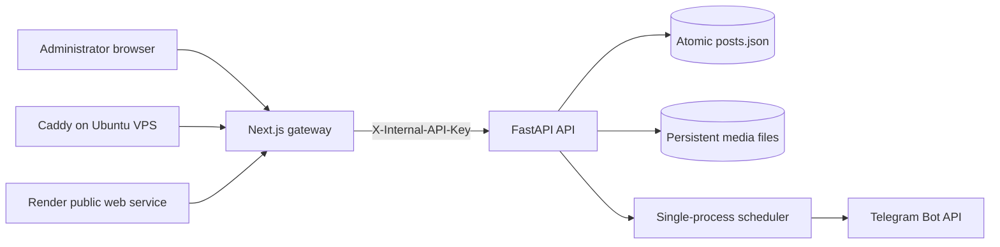

# Architecture

## Current deployment shape

Kalibr Publisher remains a modular monolith. The web and API are separate containers, but business logic is kept in one backend codebase.

All browser API calls pass through Next.js. Caddy also routes only to Next.js, preventing callers from bypassing the temporary administrator gate. FastAPI write endpoints separately require an internal service key.

## Backend modules

- `api/routes/health.py`: liveness, readiness, and metadata.
- `api/routes/posts.py`: manual post creation, upload, listing, rescheduling, and deletion.
- `api/routes/telegram.py`: immediate text publishing.
- `core/config.py`: validated environment settings and secret-safe values.
- `core/store.py`: atomic single-process JSON persistence.
- `integrations/telegram.py`: Telegram Bot API transport and media multipart requests.
- `services/publisher.py`: media resolution, Telegram dispatch, and terminal status handling.
- `services/scheduler.py`: deterministic polling of due posts.

## Current reliability model

- The JSON file is written through a temporary file, `fsync`, and atomic replacement.
- Media and post data live below persistent mounted paths.
- Pending schedules are re-read after process restart.
- Telegram connection failures are separated from ambiguous delivery outcomes.
- Ambiguous delivery outcomes become `delivery_uncertain` and are not blindly retried.
- Missing referenced media fails the post rather than silently sending text-only content.
- The process must run with one API worker because the current JSON store and scheduler are process-local.

## Security model in 0.1.1

- Temporary HTTP Basic Auth protects the Next.js UI when credentials are configured.
- A separate `INTERNAL_API_KEY` protects FastAPI write endpoints in production.
- The gateway strips browser authorization and internal-key headers before forwarding and injects its own internal key.
- Telegram tokens are loaded as secret settings and are not returned to clients or written to logs.
- Host allowlisting, explicit CORS, restrictive response headers, request-ID sanitization, bounded request timeouts, upload validation, and managed-path validation are enabled.

## Planned production architecture

Phase 2 replaces `posts.json` with SQLite/PostgreSQL through SQLAlchemy and Alembic. Later phases add transactional job claiming, durable attempts and retries, encrypted channel credentials, JWT sessions, roles, audit records, notifications, backups, and immutable media versions. Those changes are intentionally not simulated by placeholders in this archive.
