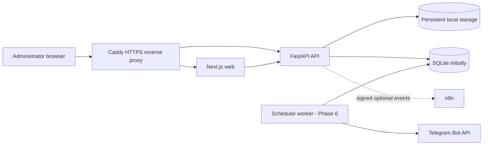

# Architecture

## System shape

Kalibr Publisher is a modular monolith. The web application and API are separate deployable containers, while business modules remain within one backend codebase and one database boundary. This preserves operational simplicity without coupling future modules together.

The Phase 1 archive implements Caddy, Next.js, FastAPI, persistent runtime paths, health checks, localization, CI, and operational documentation. Database and business modules are intentionally introduced in their designated phases so schema decisions are reviewed before use.

## Architectural boundaries

The backend will be organized by business capability rather than technical layer alone:

- `auth`: identities, passwords, sessions, JWT and CSRF.
- `users`: future users and roles.
- `channels`: production and test Telegram destinations.
- `media`: logical assets, immutable versions, physical blobs and derivatives.
- `posts`: drafts, captions, tags, buttons, albums and workflow state.
- `scheduler`: durable due-post claiming, ordering and missed-run policy.
- `publishing`: Telegram requests, retries, idempotency evidence and attempts.
- `audit`: immutable security and business activity records.
- `notifications`: persistent in-dashboard events.
- `backups`: verified export and restore operations.
- `integrations`: non-blocking signed n8n webhooks.

Cross-module communication must pass through service interfaces. HTTP routes validate transport concerns and call services; routes do not implement business rules.

## Reliability principles

1. The database is the source of truth for post schedules.
2. APScheduler will wake the worker but will not own irreplaceable schedule state.
3. Publishing attempts are durable and uniquely identified.
4. Ambiguous Telegram outcomes become `delivery_uncertain`; they are not retried blindly.
5. Scheduled posts reference immutable media versions.
6. n8n is optional and cannot block publishing.
7. Every production data path is mounted outside the container filesystem.

## Security baseline

- Containers run as non-root with dropped Linux capabilities.
- Caddy terminates TLS and removes server-identifying headers.
- API host allowlisting prevents host-header abuse.
- CORS is explicit and credential-aware.
- Browser responses receive anti-framing, MIME-sniffing and restrictive permissions headers.
- Request IDs are sanitized before entering logs.
- Production errors never expose stack traces or filesystem paths.
- Authentication secrets are introduced only in Phase 3 and will be stored through secret-safe settings types.

## Scale assumptions

The initial workload is approximately three posts per day with one administrator, one production channel and one test channel. The architecture avoids premature distributed systems. PostgreSQL, object storage and additional workers can be introduced through configuration and service adapters when concurrency or storage requirements justify them.
